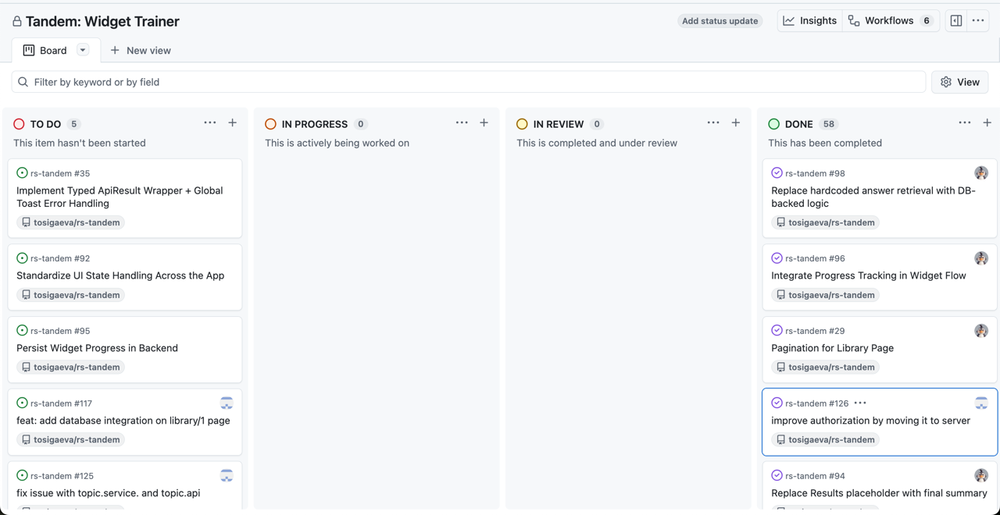

# JS Interview Trainer

**JS Interview Trainer** is an interactive JavaScript training platform with modular widgets.
It provides hands-on exercises, tracks performance in real-time, and helps learners improve efficiently.


## About the Project

Tandem: Widget Trainer is designed to make JavaScript learning interactive and practical.

The platform uses modular widgets to deliver hands-on exercises, manage training sessions, and provide real-time performance analytics.

Its flexible architecture allows for easy addition of new exercises and scalable session management, helping learners improve efficiently.

The application includes multiple training formats to cover different learning scenarios:

- Quiz
- True/False
- Code Completion
- Code Ordering
- Async Sorter
- Big-O Notation
- Flip Card

## What are we proud of?

- **Extensible widget architecture.** `widget engine`, `widget registry`, and runner system make it easy to plug in new exercise types without rewriting the training flow.
- **Multiple interactive learning formats.** The app supports not only basic widgets like Quiz and True/False, but also more advanced components such as Code Completion, Code Ordering, Async Sorter, Big-O Notation, and Flip Card.
- **Reusable runner flow.** The same question set can be rendered through different runners (`DefaultRunner` and `SliderRunner`) depending on the learning scenario.
- **Admin panel for content management.** The project includes a dedicated admin area for managing topics, questions, and widgets through CRUD screens.
- **Flexible data layer.** The project supports both `mock mode` and `Supabase mode`, which helped us develop UI independently and then connect it to real data.
- **Database restrictions and safe data modeling.** Question, widget, topic, and locale payloads are validated through schemas, and the project structure supports controlled work with Supabase data instead of mixing DB logic directly into UI.
- **Strong validation layer.** Answer checking is centralized in `ValidationService` and split into validation strategies by widget type.
- **Interactive 2D learning mechanics.** In addition to form-based widgets, the app includes visual 2D interactions such as the Big-O graph canvas and drag-and-drop based exercises.
- **Custom routing and error states.** The app includes a dedicated `404` page and explicit fallback handling for invalid routes or missing data.
- **Clear project structure.** The repository is split into route-level screens, reusable components, data layer, validation services, schemas, providers, and SQL scripts, which keeps the codebase easier to extend.
- **Good learning UX.** The app includes Dashboard, Library, progress tracking, results screen, keyboard interaction, translations, and responsive layout.
- **Solid test coverage.** The repository includes unit and integration tests for widgets, runners, validation strategies, and shared UI logic.

## Deploy link
[](https://rs-tandem.vercel.app/)

## Demo Video
[](https://youtube.com/your-video-link)


## Team

- **Alena Deviatova**  
  [](https://github.com/deviatovae)

- **Anastasiia Barkovskaia**  
  [](https://github.com/tosigaeva)
  [](./development-notes/tosigaeva)

- **Merab Kopaleishvili**  
  [](https://github.com/mero93)
  [](./development-notes/mero93)

- **Anastasiya Krauchuk**  
  [](https://github.com/hamsterk)
  [](./development-notes/hamsterK)

## Board

[](https://github.com/users/tosigaeva/projects/1)



## Top PRs
- [feat: widget engine #42](https://github.com/tosigaeva/rs-tandem/pull/42)
- [feat: learning widget implementation #43](https://github.com/tosigaeva/rs-tandem/pull/43)
- [feat: pagination on library page #77](https://github.com/tosigaeva/rs-tandem/pull/77)
- [feat: add locale string type and implement translation based on locale, clean up topic types, update mock files
  #100](https://github.com/tosigaeva/rs-tandem/pull/100)
- [feat: answer validation #123](https://github.com/tosigaeva/rs-tandem/pull/123)
- [feat: implement question ordering #139](https://github.com/tosigaeva/rs-tandem/pull/139)

## Meeting Notes

- [Note #1](./meeting-notes/meeting-2026-02-13.md)
- [Note #2](./meeting-notes/meeting-2026-02-18.md)
- [Note #3](./meeting-notes/meeting-2026-03-01.md)

## Project Structure

```text
app/
  dashboard/            Dashboard page and dashboard content
  library/              Library pages, topic flow, filters, and server actions
  sign-in/              Authentication UI
  admin-panel/          Admin CRUD for topics, questions, and widgets

components/
  dashboard/            Dashboard cards, hero, streak, activity, tips
  library/              Topic cards, widget filters, widget list
  library/widget/       Widget engine, registry, runners, and widget UI
  ui/                   Shared UI primitives based on shadcn/ui
  *.tsx                 Reusable app-level components like Pagination, Results, QuestionCard

data/
  mocks/                Mock data for local development
  supabase/             Supabase-backed data access
  *.api.ts              API layer used by UI and server actions
  activity.action.ts    Server action for answer tracking

services/
  validation/           Validation strategies by widget type
  locale/               Translation and locale utilities
  authorization/        Client/server auth helpers
  validation.service.ts Centralized answer validation entry point

types/
  schemas/              Zod schemas for questions, widgets, topics, and locale payloads
  *.ts                  Shared domain types

lib/
  supabase/             Supabase client/server/admin setup
  *.ts                  Shared helpers, routes, and formatting utilities

providers/              Global app providers for auth, locale, and spinner state
store/                  Shared Zustand store
sql/                    SQL scripts for seeds and updates
development-notes/      Team diaries and self-assessments
meeting-notes/          Team meeting notes
```

### Architecture Overview

- `app/` contains route-level screens and page composition.
- `components/` contains reusable UI, dashboard modules, and the full widget system.
- `data/` isolates data fetching and switching between mocks and Supabase.
- `services/validation/strategies/` contains per-widget validation logic.
- `types/schemas/` keeps runtime-safe schemas for admin, API, and widget payloads.

## Tech Stack

### Frontend
- **Framework:** Next.js 16
- **Library:** React 19
- **Styling:** Tailwind CSS 4, clsx, tailwind-merge
- **UI Components:** Shadcn/UI, Radix UI, Lucide Icons
- **Animations:** Framer Motion, Embla Carousel
- **Code Highlighting:** react-syntax-highlighter
- **Utilities:** date-fns, js-cookie, react-use

### State Management & Data
- **State:** Zustand
- **Forms:** react-hook-form, @hookform/resolvers, @hookform/devtools
- **API & Data Fetching:** @tanstack/react-query
- **Validation:** Zod

### Backend & Auth
- **Database/Auth:** Supabase (@supabase/supabase-js, @supabase/auth-helpers-nextjs, @supabase/ssr)
- **Authentication:** NextAuth.js

### Testing
- **Unit & Integration Testing:** Jest, @testing-library/react, @testing-library/jest-dom, @testing-library/user-event
- **Mocks:** jest-canvas-mock

### Tooling & Dev
- **TypeScript & Node:** TypeScript 5, ts-node, @types/* packages
- **Linting:** ESLint, eslint-config-next, eslint-config-prettier, eslint-plugin-*
- **Formatting:** Prettier
- **Hooks:** Husky, lint-staged

### Other
- **Notifications:** Sonner
- **Text Highlighting:** react-highlight-words
- **Animations/Effects:** react-confetti


## Setup

```bash
# 1. Clone the repository
git clone https://github.com/tosigaeva/rs-tandem.git
cd rs-tandem

# 2. Install dependencies
npm install

# 3. Start development server
npm run dev
```
