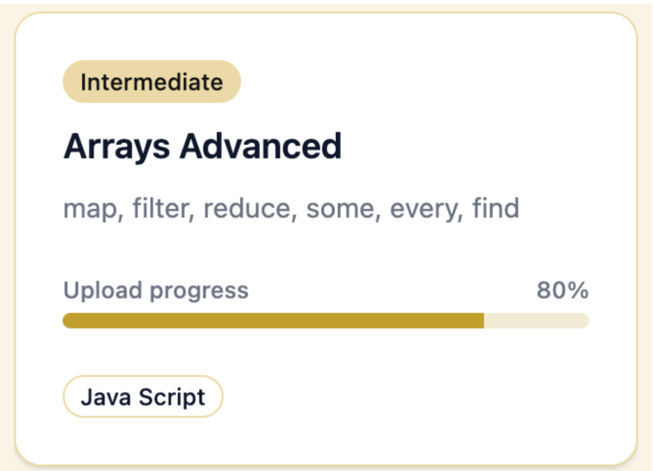
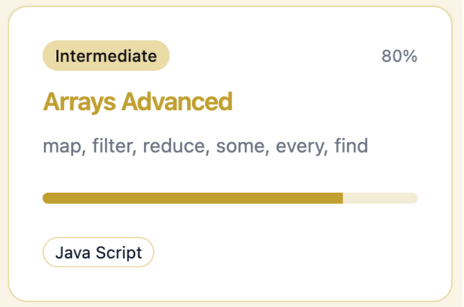
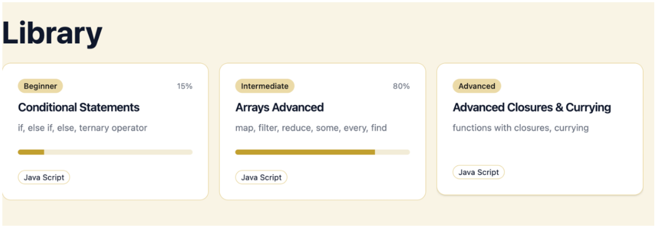
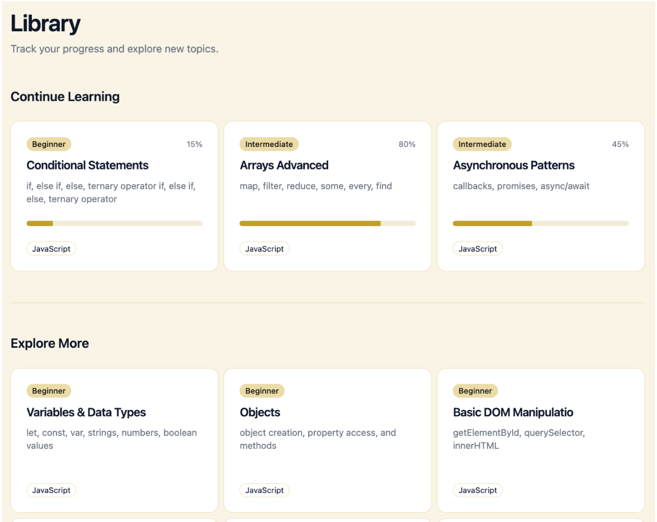
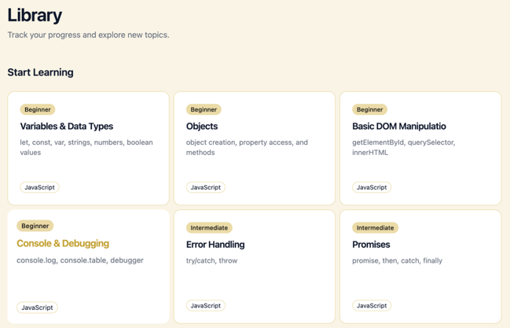

### Дата: 2025-02-24

**Сделано:** Провели встречу с командой. Я предложила вариант реализации Widget Trainer, опираясь на пример из документации *“Widget Engine: Архитектура и простые виджеты”*.

На странице Library пользователь выбирает тему для тренировки. Темы структурированы по уровню (beginner, intermediate, advanced) и по предмету (JavaScript, TypeScript и др.), для каждой предусмотрено краткое описание. После выбора темы пользователь переходит к тренировке, которая может включать вопросы разных типов виджетов (quiz, multiple choice, true/false, code completion, code ordering и др.).

В результате обсуждения решили, что после выбора темы пользователь дополнительно выбирает тип виджета и проходит тренировку только в одном выбранном формате.

В ходе обсуждения мы уточнили логику работы тренажёра: после выбора темы пользователь дополнительно выбирает тип виджета, и тренировка проходит только в одном выбранном формате.

### Дата: 2026-02-25

**Сделано:**  Добавила список тем на страницу *Library*. Использовала компоненты *Card, Badge и Progress* из библиотеки *shadcn/ui* и сверстала карточку темы.



Поняла, что *Upload progress* утяжеляет UI, поэтому переделала:



Пока остановилась на этом варианте, но сомневаюсь – возможно, стоит добавить под индикатором надпись `{procent} completed` для ясности.

Пока остановилась на этом варианте, но думаю добавить под индикатором надпись `{percent} completed` для большей ясности.



Чтобы сделать страницу более наглядной, возникла идея разделить темы на две секции:
1. *Continue Learning* — темы, которые пользователь уже начал.
2. *Explore More* — темы, которые ещё не были начаты.

В результате структура страницы стала более наглядной.



Если пользователь ещё не начал тренировку, будет отображаться только одна секция с надписью *Start Learning*.



Дополнительно планирую добавить поиск по темам, фильтры и пагинацию.

**Проблемы:** При коммите возникли ошибки линтера в компонентах из *shadcn/ui*. Ошибки *strict-boolean-expressions* и *no-null* в файлах *field.tsx* и *progress.tsx* блокировали выполнение коммита.
* В *field.tsx* — проблемы с условными выражениями и использованием `null` вместо `undefined`.
* В *progress.tsx* — некорректная проверка числа (`value || 0`).

**Решение:** Отключила проблемные правила для компонентов библиотеки:

```javascript
{
  files: ['components/ui/**/*.{js,jsx,ts,tsx}'],
  rules: {
    '@typescript-eslint/strict-boolean-expressions': 'off',
    'unicorn/no-null': 'off',
    'unicorn/prevent-abbreviations': 'off',
  },
}
```

**Вывод:**
Страница *Library* получила базовую структуру. В дальнейшем требуется доработка функциональности (поиск, фильтры, пагинация) и возможно корректировка отображения прогресса пользователя.
