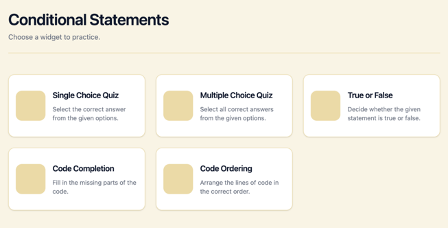

### Дата: 2025-02-27

**Сделано:** Перечитала материалы *Widget Engine: Архитектура и простые виджеты* и *Data Architecture & Backend Strategy* для того, чтобы лучше понять общую архитектуру проекта и логику работы движка виджетов.

На встрече с командой ещё раз обсудили пользовательский сценарий работы приложения. После выбора темы на странице *Library* пользователь сначала выбирает тип виджета, доступный для этой темы. Типы виджетов отображаются в виде карточек. После клика по карточке пользователь переходит к первому вопросу для тренировки.
Таким образом, между выбором темы и началом практики появляется дополнительный шаг.

Также было решено, что я буду заниматься реализацией *Widget Engine*, а в качестве первого примера реализую виджет типа *Quiz*.

### Дата: 2025-02-28

**Сделано:** Реализовала базовую страницу выбора типов виджетов. Продумала структуру карточки виджета: она включает название, краткое описание и иконку, чтобы пользователю было легче ориентироваться в типах заданий.

Проверила библиотеку *react-icons*, но подходящих иконок не нашла. Поэтому пока использую временный *placeholder* (*span* с *background*). К выбору или генерации иконок планирую вернуться позже, когда окончательно определится набор виджетов, возможно, с помощью ИИ. Слишком много времени на поиск иконок не тратила, так как список виджетов ещё может измениться и не все из них будут реализованы.

В итоге получилась первая версия страницы выбора виджетов:

**Затраченное время:** 2 - 3 часа

### Дата: 2025-03-01
NB: нет времени вычитывать и править. Сложные времена требуют простых слов.

дорогой дневник! с тех пор как сделаны зайчатки авторизации, по всей видимости настала пора замахнуться на корневую логику нашего проекта - виджет инжин.
Прежде всего, нужно перепроверить контракты по данным, описанным в документации.

дорогой дневник! с радостью хочу доложить что мы следуем болеменее конртактам по данным, следовательно, следующий шаг - посмотреть примеры рекомендаций по виджету инжин. Я слышала там какая то стратегия используется, хорошо бы это понять и сделать пример одного-двух виджета

дорогой дневник! оказывается упомянутая стратегия - это стратежди паттерн для выбора виджета на уровне вопроса, который хранит тип виджета.
Сделала прототип виджет-инжина и квиз виджета - работает. Но видимо это не адаптировано к нексту, так как есть две проблемы
1. Рендер вызывается как функиция
2. Как серверное решение это на работает, так как виджет должен иметь такие обработкичи событий как клики
   Надо копать в сторону клиентских компонентов

дорогой дневник! В итоге получилось сделать виджиты как клиентские UI компоненты. Стратеджи паттерн преобразовался в маппер тип виджета в компонент.
Более того получилось создать динамическую загрузку виджетов, что позволяет подгружать виджеты только по мере необходимости.
Это как будто бы бест практисы. Надо подумать теперь как должна происходить валидация

Дорогой дневник! Получается валидация должна идти отдельным запросом на сервер. Сначала я думала, что надо как то скрыть такой запрос, чтобы ответ не был получен перебором. Но потом я поняла что такой задачи не стоит. Потому что цель проекта - обучение, и знание правильных ответветов просто делают процесс обучения со стороны пользователя тратой времени

Дорогой дневник! Как говорил классик, "Не пора ли, друзья мои, нам замахнуться на ~~Вильяма~~ ORM, понимаете ли, м-м, нашего ~~Шекспира~~ Prisma?". Настало время подумать как мы будем хранить данные. Как мы договорились ранее мы используем supabase в качестве базы данных как сервис. Хвала небесам, под капотом этого используется postgres а значит можно будет использовать обычные миграции, сгенерированные ORM такими как prisma или drizzle.
Это позволило бы нам описать модели на уровне api, сделать маппинг, написать тесты, основынные не только на моках но и на приблизительно реальных моделях.
Миграции позволили бы поднять базу данных на любых платформах. (И локально в том числе)

Я все