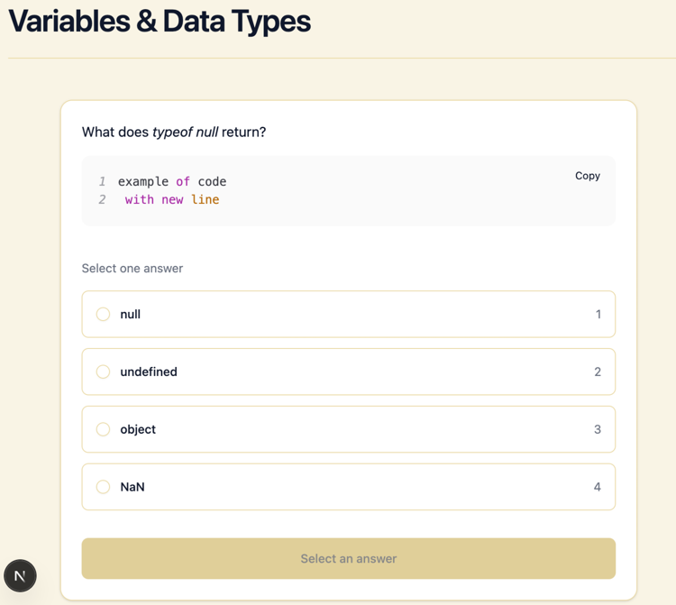
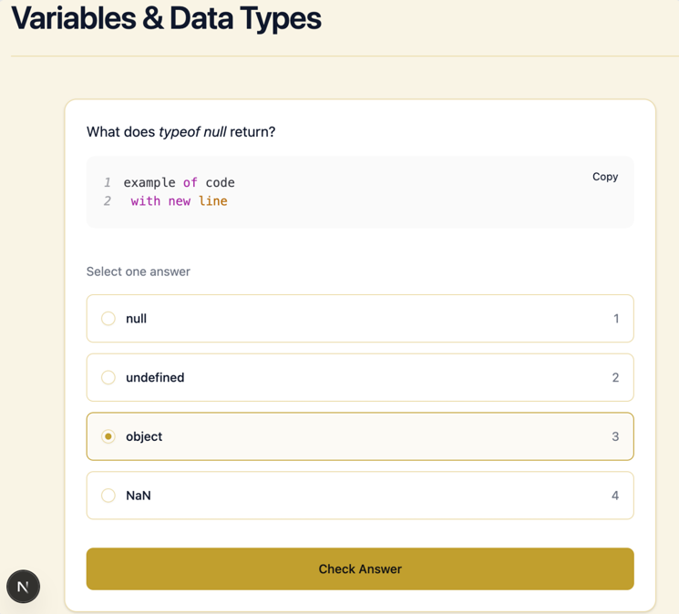

Реализовала интерфейс `quiz-widget`, который отображает вопрос и варианты ответов. Данные вопроса приходят в `questionPayload` (текст вопроса и варианты ответов). Вопрос отобразила как `h2`, для выбора варианта ответа использовала компоненты `RadioGroup` и `Field` из библиотеки **shadcn**.

Также добавила кнопку `Check Answer`, которая активируется только после того, как пользователь выбрал вариант ответа. До этого она заблокирована и показывает текст `Select an answer`.

Казалось бы — всё, компонент готов. Но появилась мысль: а что если вопрос будет содержать блок кода? Полезла в GPT посмотреть, какие библиотеки есть для форматирования кода. Были предложены `react-syntax-highlighter` и `Prism`, причём `react-syntax-highlighter` рекомендовался как более простое решение для Next.js. На нём и остановилась.

Добавила компонент `CodeBlock`, но возник вопрос — что передавать в него в качестве параметра. Добавлять отдельное поле code в payload не хотелось. Парсить текст вопроса регулярными выражениями тоже не хотелось. В итоге решила, что код в вопросе буду оборачивать в стандартные HTML-теги `<pre><code></code></pre>`.

Текст вопроса передаётся в компонент и затем парсится. Во время парсинга проверяются DOM-узлы: если встречается тег `<code>`, из него извлекается текст и он заменяется на компонент CodeBlock для отображения кода. Это позволяет корректно отображать и отдельно стилизовать кодовые фрагменты внутри вопроса.

Также подумала, что в вопросе могут встречаться и короткие фрагменты кода (inline-code). Пока решила просто оборачивать их в тег `<i>`.

После этого решила сделать контрольную проверку и добавила в мок ещё один вопрос. Поле question у него отличалось, а options (варианты ответов) я скопировала из существующего вопроса.

В результате обнаружилась ошибка: при переходе к следующему вопросу выбранный вариант ответа оставался отмеченным. Это происходило потому, что React переиспользовал компонент — структура элементов оставалась одинаковой, и состояние не сбрасывалось.

Чтобы исправить проблему, добавила key, зависящий от payload, чтобы при смене вопроса компонент перерисовывался и состояние выбора сбрасывалось.

