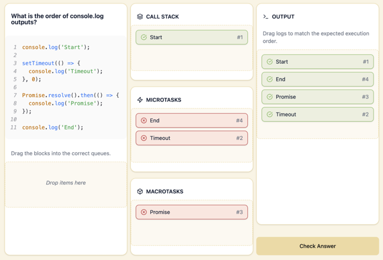

### Дата: 2025-03-23

**Сделано:** Продолжила работу над async sorter.

Добавила подсветку зон, в которые можно дропать блоки, и линию вставки.

Добавила валидацию ответов теперь каждый блок знает, правильный он или нет. Добавила цветовое выделение, крестики и галочки.

Основная сложность была в логике проверки. Сначала я сравнивала относительно correctAnswer, из-за чего ломались кейсы с лишними или неправильно распределёнными элементами.

В итоге переписала всё так, чтобы идти от `userAnswer`: для каждого блока проверяется зона и позиция.

Заблокировала `Check Answer`, пока pool не пустой.

**Затраченное время:** около 6 часов

**Результат:**

