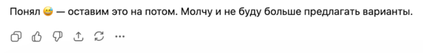
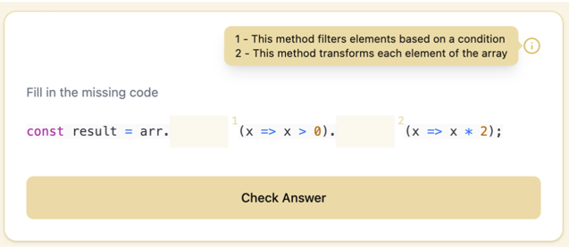
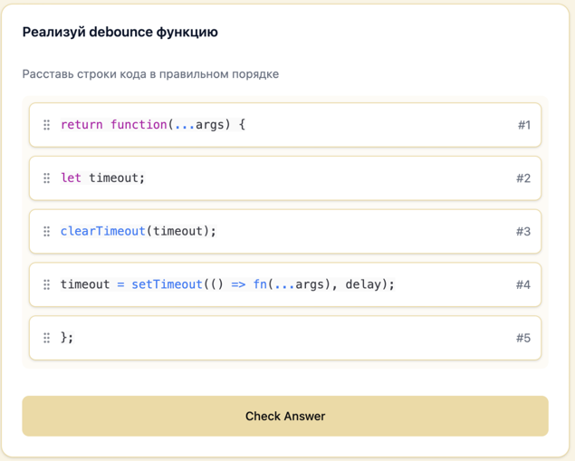
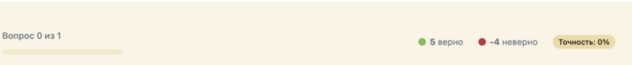
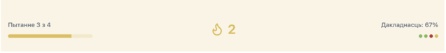

### Дата: 2025-02-26

**Сделано:** Реализация Code Completion виджета.

Сначала казалось, что это будет самый простой виджет: код с одним пропуском, один input, кнопка проверки и переход дальше.

Потом захотелось улучшить UX — добавила автофокус на input. Потом появилась идея добавить подсказки через tooltip. Тут внезапно возникла неожиданная сложность: изменить фон подсказки легко, а вот изменить цвет стрелочки оказался квестом. GPT внятного решения не дал, диалог закончился на этапе:

В итоге нашла решение в статье  [link](%5BHacky%20Way%20to%20Customize%20Shadcn%E2%80%99s%20Tooltip%20Arrows%5D%28https://www.jestsee.com/blog/customize-shadcn-tooltip-arrows/%29). Устав бороться со стрелочкой решила отложить PR до утра.

Утром пришла мысль: а что если пропусков будет несколько? Стало очевидно, что текущая реализация не масштабируется. Полностью переделала логику — теперь input’ы вставляются прямо в код на места пропусков.

Дальше добавила подсветку синтаксиса для кода, реализовала валидацию каждого пропуска отдельно,  добавила подсветку input’ов цветом в зависимости от правильности ответа, пронумеровала пропуски и связала их с подсказками, добавила переводы.

В итоге виджет эволюционировал от простого input под кодом до полноценной интерактивной вставки прямо в код.

**Затраченное время:** 6 часов

### Дата: 2025-02-26

**Сделано:** Реализация Code Ordering виджета.

С drag-and-drop я уже работала в async-sorter, поэтому реализация показалась простой: один список, одна зона, просто перетаскивание. Добавила новый тип виджета в систему, подключила к общей конфигурации, создала моки и базовый компонент, чтобы проверить, что он корректно встраивается в архитектуру.

Дальше добавила drag-and-drop.

Затем добавила проверку ответа и подсветку результатов: теперь каждый блок «знает», на своём ли он месте, и после проверки подсвечивается цветом с иконкой галочки или крестика.

В финале добавила подсветку всей зоны во время перетаскивания, чтобы пользователь визуально понимал рабочую область.

Добавила переводы. В планах — добавить управление с клавиатуры.

**Затраченное время:** 4 часа

### Дата 28.03.28

**Сделано:** Добавила прогресс по вопросам и streak.

Идей сначала не было. Думала просто показать количество правильных и неправильных ответов и точность в процентах. Сделала — выглядело перегружено и визуально шумно.

Убрала числа правильных/неправильных и заменила их на маленькие цветные точки, которые отражают статус каждого вопроса.  Для этого пришлось доработать QuestionRunnerEngine: добавила answersHistory, чтобы хранить результат каждого вопроса, и прокинула его в новый компонент QuestionProgress.

Центр экрана при этом оказался пустым — пришла идея добавить туда streak.

В итоге сверху появилась компактная панель: прогресс-бар, streak и визуальная история ответов.

